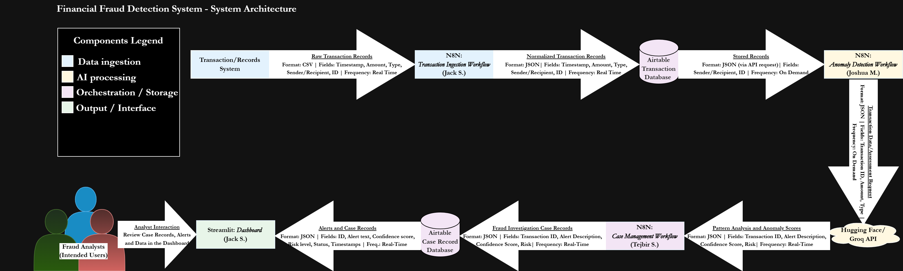

# [Financial Fraud Detection System] 
## Team Members 
| Name | Role/Component | GitHub Username | 
|------|---------------|-----------------| 
| Jack Sklover | Transaction Ingestion | @jacksklover | 
| Joshua Maldonado | Anomaly Detection | @joshuam0506 | 
| Tejbir Singh | Case Management | @[username] | 
| Jack Sklover | Dashboard | @jacksklover | 
## Problem Statement 
With the access to the Internet and digital banking being at an all-time high, financial companies are receiving a constant influx of transactions, which impedes their ability to properly detect and manage fraudulent activity. The potential of misdiagnosing a non-suspicious action such as a large withdrawal or purchase is an issue, which sometimes wrongly blocks innocent account holders instead of detecting those who are committing fraudulent acts. To combat this, a system which can reliably detect financial fraud and target those who commit fraud is exceedlingly important so that suspicious behavior can actively be distinguished from non-fraudulent activity; this will not only help the accuracy, but will also instill trust with users of these financial services as the actual fraud will be targeted. 
## Target Users 
The target users of this system are fraud investigators, financial analysts, and security teams working within banks and digital financial institutions. These professionals are responsible for monitoring transaction activity, identifying suspicious behavior, and managing fraud investigations. By using this system, they will be able to quickly detect potentially fraudulent transactions, reduce false positives, and improve the efficiency and accuracy of fraud detection. Additionally, financial institutions themselves benefit from this system, as it helps protect their customers, reduce financial losses, and maintain trust in their digital banking services.
## Architecture 
 
4 / 17
## Component Breakdown 
week-03-lab-instructions.md
### Component 1: [Name] (Owner: [Jack Sklover])- **Description:** [What this component does] - **Tools:** [n8n, Airtable, Hugging Face, etc.] - **Input:** [What data it receives] - **Output:** [What data it produces] - **Standalone demo:** [How this component can be demonstrated independently] 
### Component 2: [Name] (Owner: [Joshua Maldonado])- **Description:** [What this component does] - **Tools:** [Tools used] - **Input:** [What data it receives] - **Output:** [What data it produces] - **Standalone demo:** [How this component can be demonstrated independently] 
### Component 3: [Name] (Owner: [Tejbir Singh])- **Description:** [What this component does] - **Tools:** [Tools used] - **Input:** [What data it receives] - **Output:** [What data it produces] - **Standalone demo:** [How this component can be demonstrated independently] 
### Component 4: [Name] (Owner: [Jack Sklover])- **Description:** [What this component does] - **Tools:** [Tools used] - **Input:** [What data it receives] - **Output:** [What data it produces] - **Standalone demo:** [How this component can be demonstrated independently] 
## Data Sources- **Primary data:** [What data will you use? Where does it come from?] - **Sample data:** [What sample/test data will you create or find?] - **Data format:** [CSV, JSON, API responses, etc.] 
## AI Capabilities 
2026-02-23
| Capability | Purpose | Model/API | 
|-----------|---------|-----------| 
| [e.g., Text Classification] | [e.g., Classify alert severity] | [e.g., Hugging 
Face distilbert] | 
| [e.g., Summarization] | [e.g., Summarize incident reports] | [e.g., Groq LLaMA] 
| 
## Success Criteria
1. [Measurable criterion, e.g., "System correctly classifies 8 out of 10 test 
alerts"] 
2. [Measurable criterion, e.g., "Data pipeline processes all records within 2 
minutes"] 
3. [Measurable criterion, e.g., "Dashboard displays all enriched records with 
filtering"] 
4. [Measurable criterion, e.g., "All 4 components integrate and exchange data 
correctly"] 
5 / 17
week-03-lab-instructions.md
5. [Measurable criterion, e.g., "Each component has its own README with setup 
instructions"] 
## Timeline 
| Week | Milestone | 
|------|-----------| 
| 3 (Now) | Project proposal + architecture diagram + GitHub repo | 
| 4-6 | Build individual components, test with sample data | 
| 7-9 | Add LLM/agent capabilities, refine AI processing | 
| 10-12 | Integration, error handling, dashboard/UI | 
| 13-14 | Polish, documentation, demo preparation | 
| 15 | Final presentation | 
